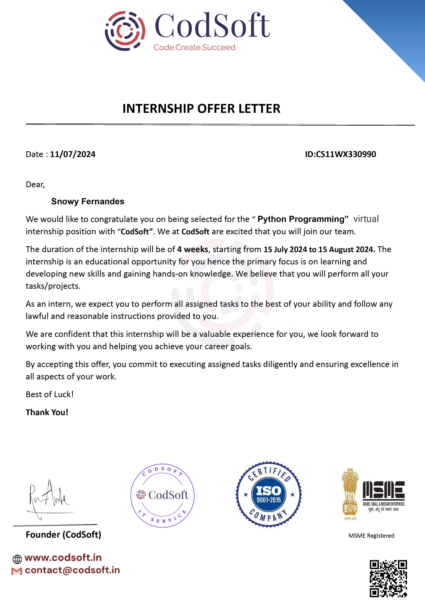

# One-Week Internship at CodSoft

## Overview

Welcome to my internship journey at CodSoft! Over the course of one week, I had the opportunity to work on a variety of exciting tasks. This README highlights the key activities and achievements from my internship.

## Offer Letter

I am thrilled to share my offer letter from CodSoft! Here's a glimpse of the formal start of my journey:

## Overview Video

Check out this brief video summarizing my internship experience:

[![Overview Video]](OverView.mp4)

## Tasks Performed

During my internship, I was involved in several key tasks that helped me gain practical experience. Below is a summary of the five main tasks I completed:

### 1. **To-Do List Application**

- **Description**: Developed a simple to-do list application allowing users to add, edit, and delete tasks.
- **Outcome**: Created an intuitive interface and implemented functionality for managing tasks.

### 2. **Calculator**

- **Description**: Built a basic calculator application that performs arithmetic operations like addition, subtraction, multiplication, and division.
- **Outcome**: Designed and implemented the user interface and calculation logic.

### 3. **Password Generator**

- **Description**: Created a password generator tool that produces strong, random passwords based on user-defined criteria.
- **Outcome**: Implemented features for customizing password length and complexity.

### 4. **Rock, Paper, Scissors Game**

- **Description**: Developed a game of Rock, Paper, Scissors where users can play against the computer.
- **Outcome**: Designed the game logic and user interface, including win/lose conditions.

### 5. **Contact Book**

- **Description**: Implemented a contact book application for storing and managing contact information.
- **Outcome**: Created features for adding, updating, and deleting contacts.

## Key Takeaways

- **Skills Acquired**: Learned about application development, user interface design, and basic programming concepts.
- **Challenges Overcome**: Navigated through various programming challenges and improved problem-solving skills.
- **Overall Experience**: Gained valuable hands-on experience and insights into real-world software development.

## Thank You!

A big thank you to the CodSoft team for the incredible learning experience. I am grateful for the opportunity to contribute and grow during this internship.

Feel free to explore the [CodSoft website](https://www.codsoft.com) for more information about the company and its projects.

---

*This README was created to document my one-week internship experience and showcase my contributions and learnings.*
